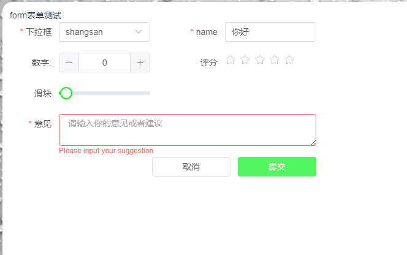

# vue3-Xw-from

基于 `Vue3` + `Element-plus` 封装的 `Form` 组件，支持所有 `Element-plus Form` 组件配置项 [文档](https://element-plus.gitee.io/zh-CN/component/form.html)

### 使用方法
* 根目录下执行 `npm i vue3-Xw-from` 命令
```POWERSHELL
npm i vue3-Xw-from
```

* 全局挂载组件
```JAVASCRIPT
import { createApp } from 'vue'
import App from './App.vue'
import XwForm from 'vue3-Xw-from'

createApp(App).use(XwForm).mount('#app')
```

* 在页面上使用
```HTML
<!-- template -->
<XwForm label-width="80px" v-model="state.formDate" :form-column="formColumn" :rules="rules">
<template #footer>
    <div class="w-full flex justify-end">
        <el-button>取消</el-button>
        <el-button type="primary" @click="handleSubmit">提交</el-button>
    </div>
</template>
</XwForm>
```

### Form 属性

除此之外支持所有 `el-form` 所有 `属性`

| 参数              | 说明                                                       |  类型   | 默认值 |
| :---------        | :------------------------------------------------------   | :-----: | :----: |
|  v-model         | 表单数据,双向绑定(字段需与 `prop` 属性一样)                  |  Object  |   -    |
| form-column       | 表单配置项,详情见下方 `Column` 属性                           |  Array  |   -    |
| rules         | 表单规则验证,校验规则请参考 [el-form](https://element-plus.gitee.io/zh-CN/component/form.html#%E8%87%AA%E5%AE%9A%E4%B9%89%E6%A0%A1%E9%AA%8C%E8%A7%84%E5%88%99)           | Object | -  |

### Form 方法

表单组件已给 `el-form` 绑定 `ref` 并用 `defineExpose` 暴露出来，我们只需要在引入组件中绑定ref,即可调用 `el-form` 的方法
```HTML
<XwForm ref="baseForm"></XwForm>
```
调用方式

```JAVASCRIPT
const baseForm = ref<HTMLElement | null>(null)
baseForm.value.formRef.resetFields()
```


### Column 配置 

| 参数 | 说明                         |  类型   | 默认值 |
| :--- | :--------------------------- | :-----: | :----: |
| type       | 表单类型,elementplus的组件以及自己定义的组件 |  String  |   -    |
| slotName | 插槽,开启 `slot` 支持(开启这个属性,其它属性无效,可选项) | String | ''  |
| label | `el-form-item label` 属性 | String | -  |
| prop | `el-form-item prop` 属性 | String | -  |
| col | col的属性 | Object | -  |
| formItemProps | el-form-item的props | Object | -  |
| componentsProps | elementplus的组件自定义的组件的props和event | Object | -  |

### 下面是示例
</img>
```vue3
<template>
  <main-card>
    <span>form表单测试</span>
    <section class="w-500">
      <form-custom label-width="80px" v-model="state.formDate" :form-column="formColumn" :rules="rules">
        <template #footer>
          <div class="w-full flex justify-end">
            <el-button>取消</el-button>
            <el-button type="primary" @click="handleSubmit">提交</el-button>
          </div>
        </template>
      </form-custom>
    </section>
  </main-card>
</template>

<script setup lang="ts">
import { ref, reactive, markRaw } from 'vue'
import CustomSelect from '@/components/customSelect/index.vue'
const options = [
  {
    value: 'zhangan',
    label: 'shangsan'
  }
]
const formColumn = markRaw([
  {
    col: { span: 11 },
    formItemProps: {},
    label: '下拉框',
    prop: 'select',
    componentsProps: { options: options, clearable: true, onChange: handlerChange, onVisibleChange: handlerChangeVisible },
    type: CustomSelect
  },
  {
    col: { span: 11, offset: 2 },
    formItemProps: {},
    label: 'name',
    prop: 'val',
    componentsProps: { clearable: true },
    type: 'el-input'
  },
  {
    col: { span: 11, },
    formItemProps: {},
    label: '数字:',
    prop: 'val2',
    componentsProps: { clearable: true, placeholder: "Please input" },
    type: 'el-input-number'
  },
  {
    col: { span: 11, offset: 2 },
    formItemProps: {},
    label: '评分',
    prop: 'val3',
    componentsProps: { clearable: true },
    type: 'el-rate'
  },
  {
    col: { span: 11, },
    formItemProps: {},
    label: '滑块',
    prop: 'val4',
    componentsProps: { clearable: true },
    type: 'el-slider'
  },
  {
    col: {span: 11,offset: 2},
    formItemProps: {},
    label: '开关',
    prop: 'val6',
    componentsProps: {},
    type: 'el-switch'
  },
  {
    col: { span: 24, },
    formItemProps: {},
    label: '意见',
    prop: 'val5',
    componentsProps: { clearable: true, type: "textarea", placeholder: '请输入你的意见或者建议' },
    type: 'el-input'
  },
  {
    slotName: 'footer',
    col: { span: 24 },
    formItemProps: {},
    label: '',
    prop: '',
    componentsProps: {},
    type: ''
  }
])
const rules = markRaw({
  select: [
    { required: true, message: 'Please select name', trigger: 'change' }
  ],
  val: [
    { required: true, message: 'Please input Activity name', trigger: 'blur' }
  ],
  val5: [
    {
      required: true, message: 'Please input your suggestion', trigger: 'blur'
    }
  ]
})
const state = reactive({
  formDate: {
    select: 'zhangan',
    val: '你好',
    val2: 0,
    val3: undefined,
    val4: 8,
    val5: '你好哇',
  },
})

function handlerChange(val: any) {
  console.log(val)
}

function handlerChangeVisible(val: boolean) {
  console.log(val)
}

function handleSubmit() {
  console.log(state.formDate, "formDate")
}

</script>
### 温馨提示对于一些复杂的组件需要自己封装再使用这个组件
## 存在一些问题请勿喷，还在修改中。

```


